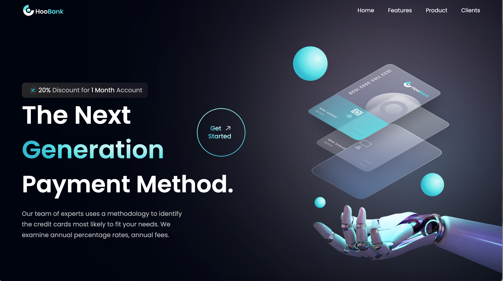

# HooBank

A Responsive ReactJS Application with Tailwind CSS

## Description

This project is a modern web application developed using ReactJS and Tailwind CSS. It showcases a stunning hero section, high-quality assets and gradients, business stats, reusable feature sections with call-to-action buttons, testimonials, and more! The application is designed to be fully responsive, providing a seamless and user-friendly experience across devices.

## Features

- Stunning hero section with captivating imagery and compelling headline
- High-quality assets and gradients to enhance the visual appeal
- Business stats section to showcase key metrics and data
- Reusable feature sections with call-to-action buttons for different functionalities
- Testimonials section to display user feedback and social proof
- Fully responsive design for optimal viewing on desktops, tablets, and mobile devices

## Installation

1. Clone the repository: `git clone https://github.com/your-username/project-name.git`
2. Navigate to the project directory: `cd project-name`
3. Install the dependencies: `npm install`

## Usage

1. Start the development server: `npm start`
2. Open your browser and visit: `http://localhost:3000`

## Contributing

Contributions are welcome! If you'd like to contribute to this project, please follow these steps:

1. Fork the repository
2. Create a new branch: `git checkout -b feature/your-feature-name`
3. Make your changes and commit them: `git commit -m 'Add some feature'`
4. Push to the branch: `git push origin feature/your-feature-name`
5. Submit a pull request

## License

This project is licensed under the MIT License. See the [LICENSE](LICENSE) file for more details.

## Contact

For any inquiries or questions, please reach out to me at [your-email@example.com](mailto:your-email@example.com).
